<div align="center">
  

  # 🏛️ THE INVITE MASTER COMMAND CENTER
  **High-Performance SaaS for Premium Digital Invitations**

  [](https://nuxt.com)
  [](https://pages.cloudflare.com)
  [](https://developers.cloudflare.com/d1)
  [](https://bun.sh)
  [](https://www.typescriptlang.org/)
  [](https://tailwindcss.com)
  [](https://orm.drizzle.team/)

  ---

  <p align="center">
    <a href="#-project-philosophy"><strong>Philosophy</strong></a> •
    <a href="#-tech-stack-deep-dive"><strong>Tech Stack</strong></a> •
    <a href="#-core-features"><strong>Features</strong></a> •
    <a href="#-hybrid-architecture"><strong>Architecture</strong></a> •
    <a href="#-getting-started"><strong>Getting Started</strong></a> •
    <a href="#-deployment"><strong>Deployment</strong></a> •
    <a href="#-administrative-playbook"><strong>Admin Ops</strong></a> •
    <a href="#-troubleshooting"><strong>Troubleshooting</strong></a>
  </p>

</div>

---

## 💎 Project Philosophy
**Premium Invitation** is a high-fidelity digital ecosystem designed for sacred life events. We bridge the gap between traditional luxury and modern performance. Our goal is to provide a "Zero-Latency" experience where every interaction feels instantaneous and every design choice screams "Premium".

> **The Identity**: Minimalist, Luxurious, and Uncompromising on Speed.

---

## ⚡ Tech Stack Deep Dive

We chose our stack for maximum performance and developer velocity:

| Layer | Technology | Purpose |
|-------|------------|---------|
| **Frontend** | [Nuxt 4](https://nuxt.com) | Universal rendering & optimized performance |
| **Runtime** | [Bun](https://bun.sh) | Ultra-fast execution & package management |
| **Styling** | [Tailwind CSS](https://tailwindcss.com) | Utility-first CSS for responsive designs |
| **Database** | [Cloudflare D1](https://developers.cloudflare.com/d1) | Edge-native SQLite with global replication |
| **ORM** | [Drizzle ORM](https://orm.drizzle.team/) | Type-safe database queries |
| **Hosting** | [Cloudflare Pages](https://pages.cloudflare.com) | Zero-cold-start edge deployment |
| **Authentication** | [Better Auth](https://www.better-auth.com/) | Secure auth with Google & Email support |
| **Automation** | [Puppeteer](https://pptr.dev/) | Headless browser for transaction scraping |
| **Notifications** | WhatsApp Cloud API + `whatsapp-web.js` | Dual-bot notification system |
| **Observability** | [Sentry](https://sentry.io) | Real-time error tracking |
| **Animations** | [Motion](https://motion.dev/) | Smooth, high-performance UI transitions |

---

## ✨ Core Features

### 🛠️ The Real-Time Editor
- **WYSIWYG Experience**: Change colors, fonts, and layouts with instant preview.
- **Cinematic RSVP**: Beautifully crafted forms for guest confirmation.
- **Music Autoplay**: Immersive audio experience triggered upon opening.
- **Custom Slugs**: Every invitation gets a unique, branded URL.

### 📲 Dual WhatsApp Notification System
- **Meta Cloud API (VVIP)**: Official API for guaranteed delivery to VIP & Admin users.
- **Local QR Bot (Regular)**: Cost-effective `whatsapp-web.js` bot running on CasaOS for regular users.
- **Unified Queue**: Cloudflare D1 queue ensures no notification is lost.

### 🤖 Unified Background Worker
- **CasaOS Worker**: Polls Cloudflare D1 for pending notifications and dispatches via local bot.
- **GoFood Scraper**: Headless Puppeteer scrapes payment dashboards to verify orders.
- **Auto-Expiry Logic**: Automatically handles plan downgrades and expiration.

### 💳 Premium Payments & Referrals
- **Flip Integration**: Seamless payment processing with automated callbacks.
- **Referral Ledger**: Track and reward users who bring in new business.
- **Flexible Plans**: VVIP, VIP, Regular, and Free tiers with strict role-based access.

---

## 🏗️ Hybrid Architecture

Engineered for **Zero-Downtime**, **Maximum Scalability**, and **100% Free Hosting**.

```mermaid
graph TD
    User([👤 User / Guest]) -->|HTTPS| CF[☁️ Cloudflare Pages]
    
    subgraph "Cloudflare Edge (Global)"
        CF --> Nitro[⚡ Nuxt 4 / Nitro SSR]
        Nitro --> D1[(🗄️ Cloudflare D1)]
        Nitro -->|VVIP Notif| MetaAPI[📱 WhatsApp Cloud API]
        Nitro -->|Queue Regular Notif| D1
    end
    
    subgraph "CasaOS Local (Laptop)"
        Worker[🤖 CasaOS Worker] -->|Poll Queue| D1
        Worker -->|Dispatch| LocalBot[📲 whatsapp-web.js]
        Worker -->|Headless Scrape| GoFood[GoFood Dashboard]
        Worker -->|Sync Payments| D1
    end
    
    MetaAPI -->|Notification| VIP([👑 VVIP User])
    LocalBot -->|Notification| Regular([👤 Regular User])
```



### Key Benefits
| Aspect | Benefit |
|--------|---------|
| **Cost** | 100% free tier (Cloudflare + CasaOS) |
| **Latency** | < 50ms global response time |
| **Scalability** | Edge-first, auto-scaling |
| **Reliability** | Dual-bot failover for notifications |

---

## 📂 Project Structure

```text
├── app/                      # Frontend Application (Nuxt/Vue)
│   ├── components/           # UI Components
│   ├── pages/                # View Routes
│   ├── assets/               # Global Styles & Assets
│   └── composables/          # Shared Logic
├── server/                   # Nitro Backend
│   ├── api/                  # API Endpoints
│   ├── db/                   # Drizzle Schema & Migrations
│   │   ├── schema.ts         # Database schema definitions
│   │   └── migrations/       # D1 migration files
│   ├── middleware/           # Auth & Security
│   └── utils/                # Shared Server Utilities
├── scripts/                  # Administrative & Tooling
│   ├── deploy/               # Deployment automation
│   └── tools/                # Maintenance utilities
├── public/                   # Static Assets
├── worker.ts                 # Legacy VPS worker (deprecated)
├── casaos-worker.ts          # CasaOS background worker
├── wrangler.toml             # Cloudflare configuration
└── drizzle.config.ts         # Database Configuration
```

---

## 🚀 Getting Started

### Prerequisites
- **Bun** (v1.1+): `curl -fsSL https://bun.sh/install | bash`
- **Node** (v20+)
- **WSL2** (If on Windows)

### Local Development
```bash
# 1. Clone & Install
git clone <repo_url>
cd premium-invitation
bun install

# 2. Environment Setup
cp .env.clean .env
# Fill in: DATABASE_URL, BETTER_AUTH_SECRET, etc.

# 3. Database Migration (Local SQLite)
bun run migrate.ts

# 4. Start Dev Server
bun dev
```

---

## ☁️ Deployment

### Cloudflare Pages (Production)

1. **Push to GitHub**
   ```bash
   git remote add origin https://github.com/YOUR_USERNAME/premium-invitation.git
   git branch -M main
   git push -u origin main
   ```

2. **Connect to Cloudflare Pages**
   - Go to [Cloudflare Dashboard](https://dash.cloudflare.com) → Pages
   - Click **Connect to Git** → Select `premium-invitation`
   - Build settings:
     - Framework: `Nuxt.js`
     - Build command: `npm run build`
     - Output directory: `.output/public`

3. **Environment Variables** (Required in Cloudflare Dashboard):
   | Variable | Description |
   |----------|-------------|
   | `NUXT_HUB_PROJECT_KEY` | Random string for NuxtHub |
   | `INTERNAL_API_SECRET` | Secret for CasaOS worker auth |
   | `WHATSAPP_PHONE_ID` | Meta Cloud API Phone ID |
   | `WHATSAPP_TOKEN` | Meta Cloud API Access Token |
   | `WHATSAPP_TARGET_PHONE` | Admin phone (format: 62xxx) |

4. **D1 Database Binding**
   - Database Name: `premium-invitation-db`
   - Database ID: `bb43abd1-bf7c-4119-a685-7150b358f2eb`

### CasaOS Worker (Local)

After Cloudflare is live, configure the local worker:

```typescript
// casaos-worker.ts
const API_BASE_URL = 'https://your-app.pages.dev'
const API_SECRET = 'your-internal-api-secret'
```

Run the worker:
```bash
bun run casaos-worker.ts
```

---

## 🛠️ Administrative Playbook

Technical Reference for System Administrators.

### 🔐 User & Auth Management
| Command | Description |
|---------|-------------|
| `bun create-admin-account.ts` | Provision a new admin user |
| `bun reset-admin.ts` | Emergency password reset |
| `bun list-users.ts` | Audit existing user base |

### 🗄️ Database Utilities
| Command | Description |
|---------|-------------|
| `bun check-db.ts` | Verify database integrity |
| `bun migrate-to-camelcase.ts` | Schema naming convention updates |
| `bun clear-sessions.ts` | Flush all active sessions |

### 🤖 Worker Operations
| Command | Description |
|---------|-------------|
| `bun casaos-worker.ts` | Start the CasaOS background worker |
| `bun test-whatsapp.ts` | Verify WhatsApp notification delivery |
| `bun test-expiry-logic.ts` | Dry-run plan expiration scheduler |

### 🚨 Wrangler CLI (Cloudflare)
| Command | Description |
|---------|-------------|
| `npx wrangler d1 execute premium-invitation-db --file=seed.sql` | Seed database |
| `npx wrangler pages deployment list` | List deployments |
| `npx wrangler tail` | Live logs from Cloudflare |

---

## 🔧 Troubleshooting

### Common Issues

<details>
<summary><strong>❌ Build fails on Cloudflare</strong></summary>

**Cause**: Dependencies like `puppeteer` or `whatsapp-web.js` cannot be bundled for edge.

**Solution**: These are only used in `casaos-worker.ts`, which runs locally. Ensure they are in `devDependencies` and not imported in server routes.
</details>

<details>
<summary><strong>❌ WhatsApp notifications not sending</strong></summary>

**Cause**: QR session expired or Meta API token invalid.

**Solution**:
1. For local bot: Delete `whatsapp-auth/` folder and restart worker to re-scan QR.
2. For Meta API: Regenerate token in Meta Business dashboard.
</details>

<details>
<summary><strong>❌ D1 database not syncing</strong></summary>

**Cause**: Migration pending or binding misconfigured.

**Solution**:
```bash
npx wrangler d1 migrations apply premium-invitation-db
```
Verify `wrangler.toml` has correct `database_id`.
</details>

<details>
<summary><strong>❌ CasaOS worker cannot reach Cloudflare</strong></summary>

**Cause**: Network issue or incorrect API_BASE_URL.

**Solution**: Ensure `API_BASE_URL` points to your Cloudflare Pages URL (e.g., `https://premium-invitation.pages.dev`).
</details>

---

## 📝 Recent Updates

See [DEPLOYMENT_GUIDE_FINAL.md](DEPLOYMENT_GUIDE_FINAL.md) for the latest deployment instructions.

---

<p align="center">
  <b>Built for permanence. Engineered with integrity.</b><br>
  <sub>Copyright &copy; 2025-2026 Undangan SaaS • NieVl</sub>
</p>
